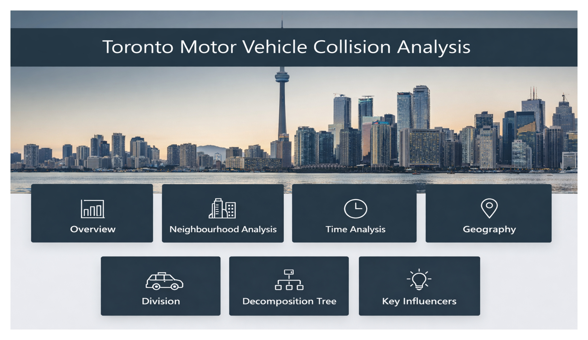
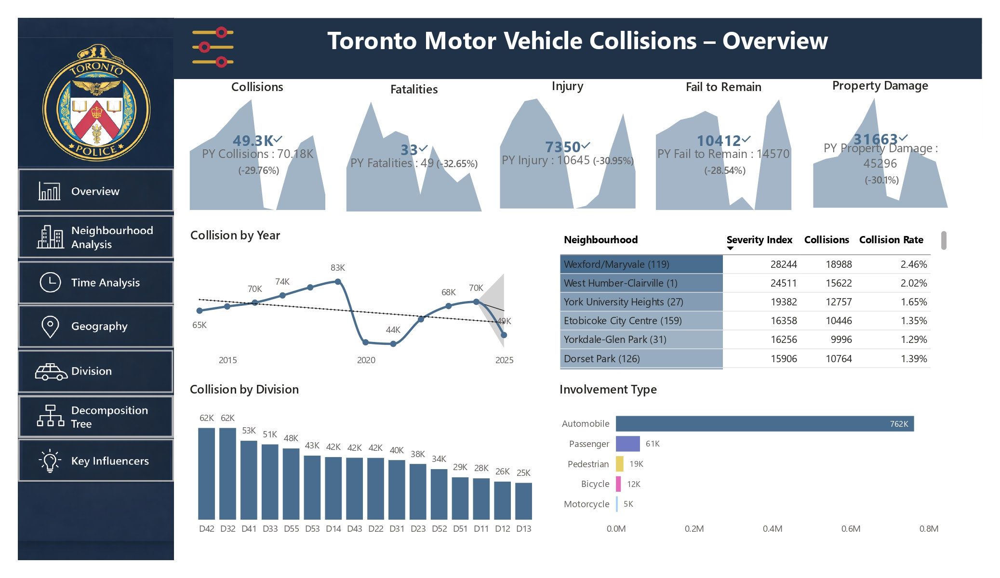
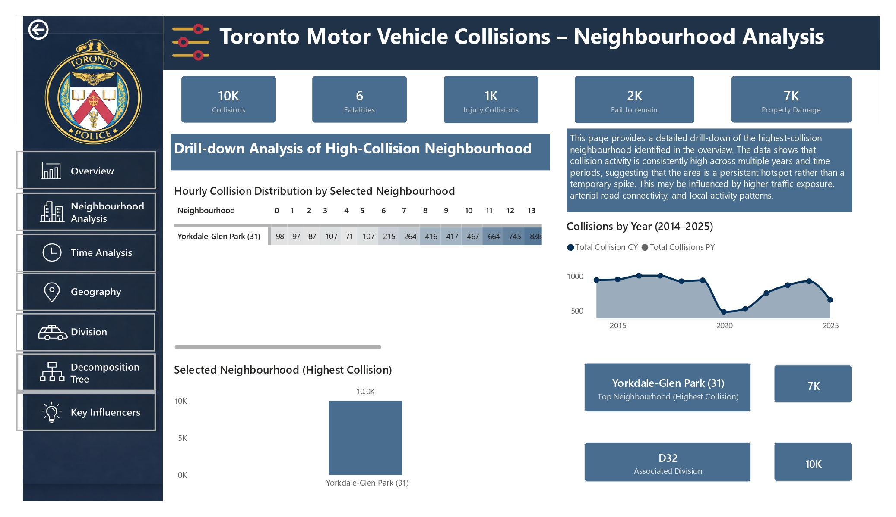
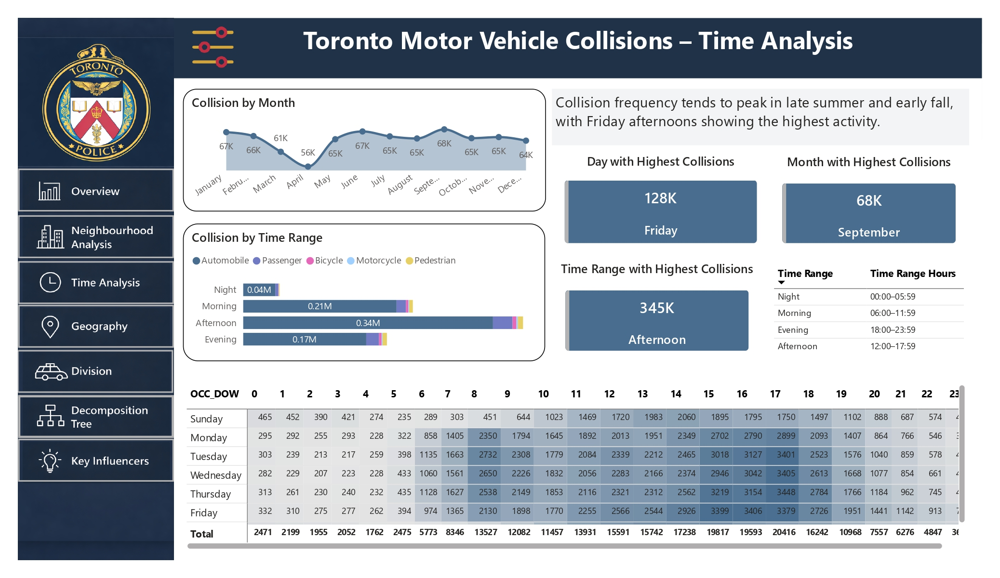
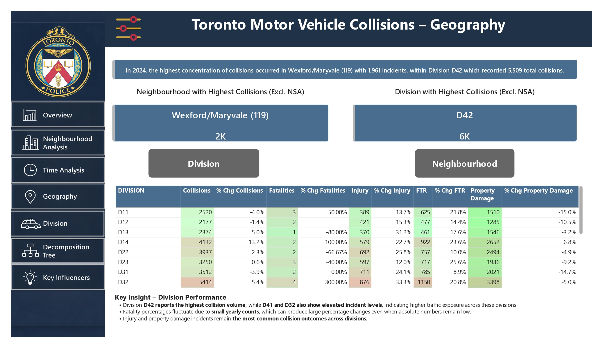
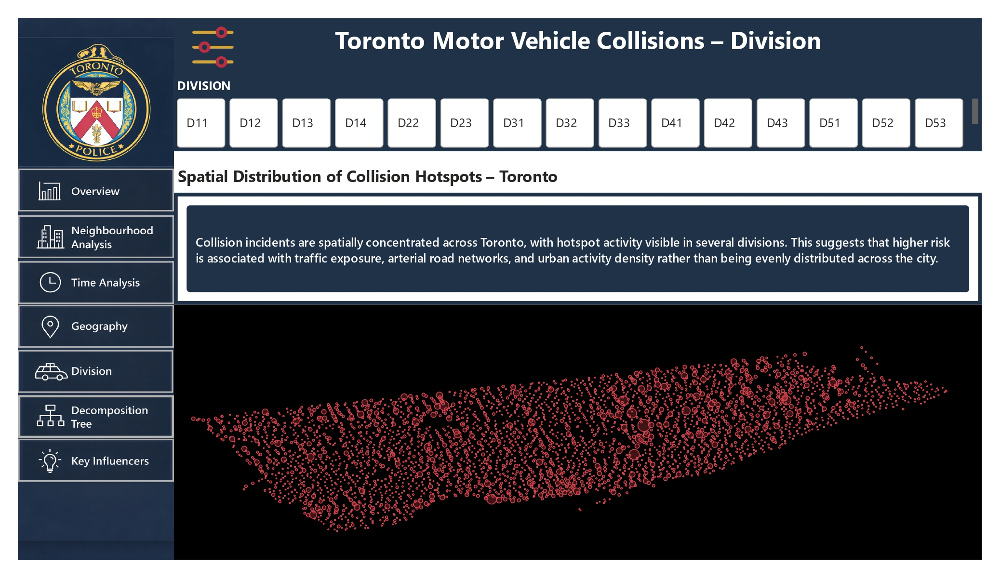
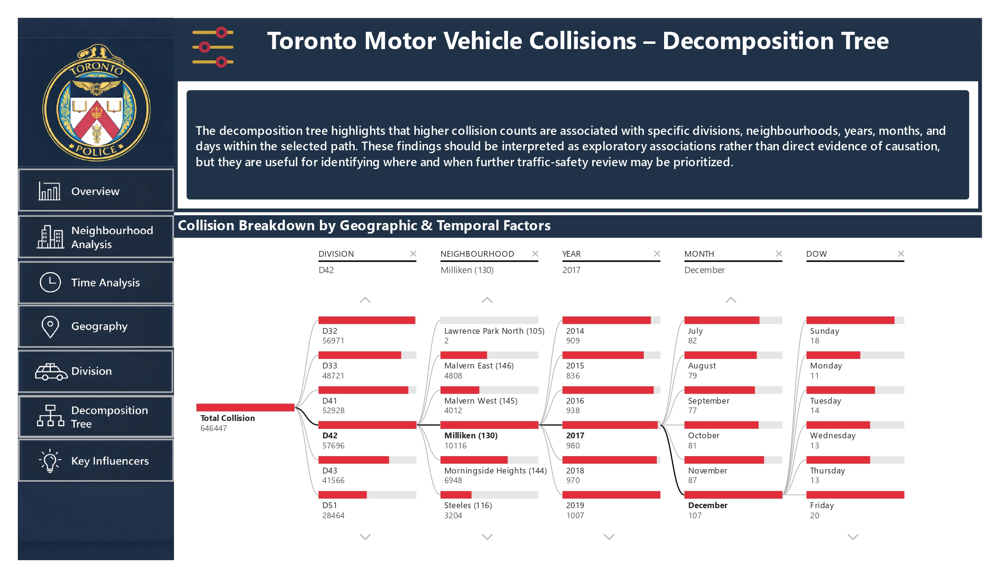
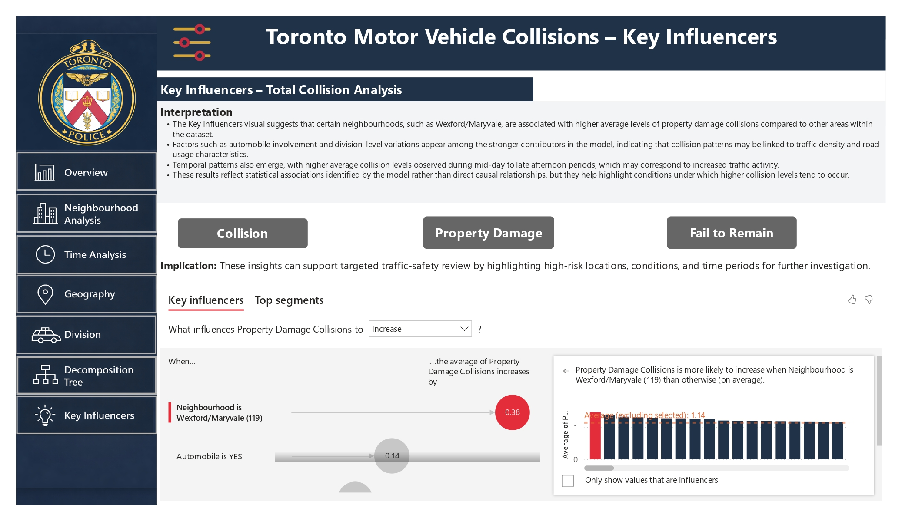
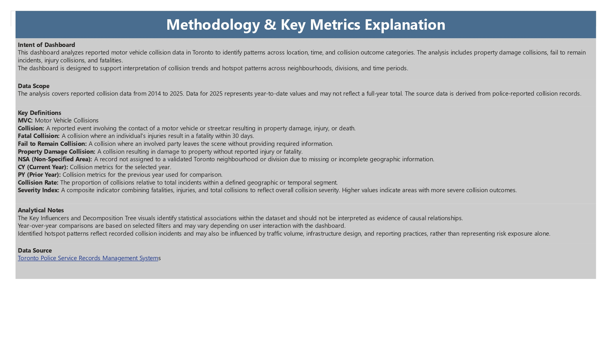
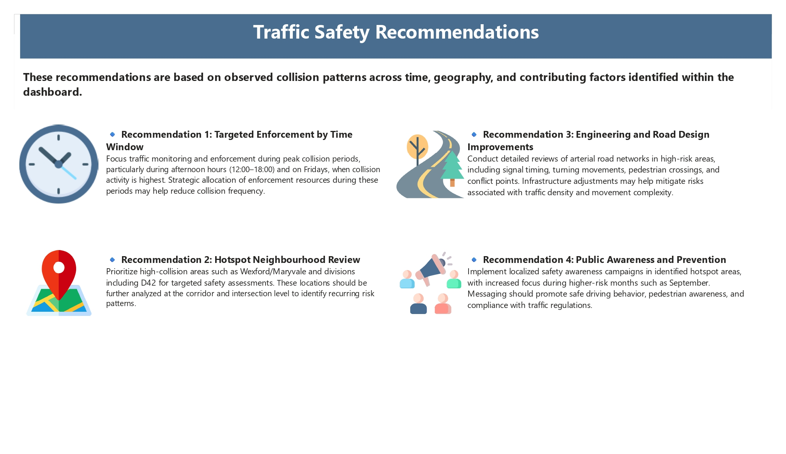

<h1 align="center">🚗 Toronto Motor Vehicle Collision Analysis</h1>
<h3 align="center">📊 Capstone Project – Master of Data Analytics</h3>

  <b>Real-world Data | Machine Learning | Power BI Dashboard</b>

  
  
  
  

---

## 📌 Project Overview  

This project analyzes **motor vehicle collisions in Toronto** using real-world data from the **Toronto Police Service Open Data Portal**.

The goal is to:
- Identify **collision patterns**
- Detect **high-risk locations & time periods**
- Build **predictive models** for fatal accident risk
- Deliver **actionable insights** using dashboards

---

## 📂 Dataset  

- 📊 **770,000+ collision records**  
- 📅 **Time Period:** 2014 – 2025  
- 📍 Includes **temporal, spatial, and road-user variables**

---

## ⚙️ Project Workflow  

✔ Data Cleaning & Preprocessing  
✔ Feature Engineering (Rush Hour, Night, Weekend)  
✔ Exploratory Data Analysis  
✔ Power BI Dashboard Development  
✔ Machine Learning Modeling  

---

## 📊 Dashboard Preview  

### 🏠 Dashboard Home  

### 📊 Collision Overview  

### 🏙️ Neighbourhood Analysis  

### ⏱️ Time Analysis  

### 🌍 Geography Analysis  

### 🏢 Division Analysis  

### 🌳 Decomposition Tree  

### 🔍 Key Influencers  

### 🧠 Methodology  

### 💡 Recommendations  

---

## 🔍 Key Insights  

📈 Peak collisions during **afternoon (12 PM – 6 PM)**  
📅 **Fridays** show highest collision frequency  
🍂 **Late summer (September)** sees increased accidents  
📍 Hotspots identified:
- Wexford/Maryvale  
- Division D42  

🚶 Pedestrians are at **higher risk of severe injuries**

---

## 🤖 Machine Learning  

### Models Used:
- Logistic Regression  
- Random Forest  
- XGBoost  

### 🏆 Final Model:
**Tuned Random Forest**

### 📊 Performance:
- Accuracy: ~67%  
- Recall (Fatal): ~44%  
- Precision: ~25%  

📌 Focus on **recall** to detect more high-risk cases

---

## ⚠️ Challenges  

- Imbalanced dataset (~17% fatal cases)  
- Missing real-world features (weather, speed, behavior)  
- Precision vs Recall trade-off  

---

## 💡 Recommendations  

✔ Target enforcement during **peak hours**  
✔ Focus on **high-risk neighbourhoods**  
✔ Improve **infrastructure & traffic control**  
✔ Increase **public safety awareness**

---

## 🛠️ Tech Stack  

- 🐍 Python (Pandas, NumPy, Scikit-learn)  
- 📊 Power BI  
- 🤖 Machine Learning  
- 📈 Data Visualization  

---

## 👨‍💻 Contributors  

- **Sumit Chhillar**  
- Team Members  

---

## ⭐ Final Thoughts  

This project highlights how **data analytics + machine learning** can solve **real-world urban safety problems** and support **data-driven decision-making**.

---

## 📬 Let’s Connect  

If you’re interested in **Data Analytics / Business Intelligence roles**, feel free to connect!
